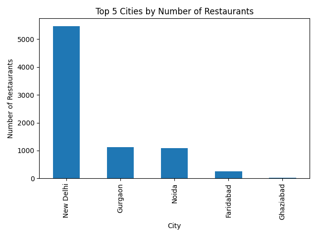

# COGNIFYZ - DATA ANALYSIS LEVEL 1 TASK 2

## 📌 Project Overview
This project focuses on analyzing restaurant distribution and ratings across different cities. The analysis helps identify cities with the highest restaurant presence and best customer ratings.

---

## 🛠 Tools & Technologies Used
- Python
- Pandas
- Matplotlib

---

## 🎯 Objective
The objectives of this task are:
- Identify cities with the highest number of restaurants
- Analyze average ratings by city
- Discover top-rated cities
- Visualize restaurant distribution

---

## 📂 Dataset Description
The dataset contains restaurant information including:
- Restaurant names
- City locations
- Ratings
- Cuisine details
- Online delivery services
- Price ranges

---

## ⚙️ Steps Performed
1. Loaded dataset using pandas
2. Counted restaurants city-wise
3. Calculated average ratings by city
4. Identified top cities
5. Created bar chart visualization

---

## 📊 Data Visualization

### 🔹 Top Cities by Restaurants

---

## 🔍 Key Insights
- New Delhi has the highest number of restaurants
- Gurgaon and Noida also contain many restaurants
- Restaurant distribution varies significantly across cities
- Highly active cities show greater food business opportunities

---

## 📈 Business Recommendations
- Businesses can target cities with high restaurant activity
- Restaurant owners can study competition city-wise
- Food delivery services can focus on highly populated food markets

---

## ✅ Conclusion
City analysis helps understand restaurant market distribution and customer trends across different locations. This analysis can support business expansion and marketing strategies.